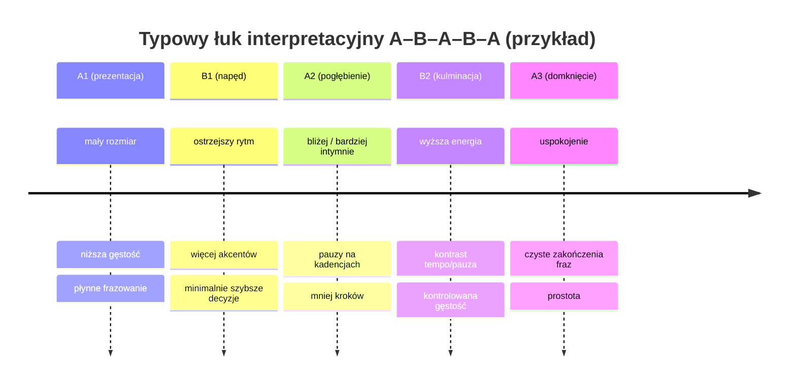

# System antymonotonii w tangu argentyńskim

## Podsumowanie wykonawcze

Monotonia w tangu argentyńskim najczęściej nie wynika z „braku figur”, tylko z utrzymywania stałej **jakości ruchu** i stałego „nastawu” przez kolejne frazy oraz sekcje utworu (zwrotki/refreny/parte instrumentalne). Źródła z obszaru tango-studies podkreślają, że sedno tej praktyki to **wspólna improwizacja i interpretacja muzyki**, a nie wykonywanie z góry ustalonych sekwencji. citeturn10view0turn1search20

Poniżej dostajesz prosty system „na milongę” i „na praktykę”: **CPE‑8 + ROLA**. „CPE” to trzy gałki (Czas–Przestrzeń–Energia), które obejmują 8 konkretnych parametrów: **rozmiar, szybkość, energia, pauzy, gęstość, rotacja, bliskość, frazowanie**. „ROLA” to szybka decyzja, jaką funkcję ma dana sekcja muzyki (np. „prezentacja”, „napęd”, „szept”) – dzięki temu kolejne zwrotki są czytelnie różne, bez komplikowania kroków. System opiera się o powszechne w pedagogice ruchu rozróżnienie jakości (czas/energia/przestrzeń) i jest spójny z praktyką tango jako tańca, w którym „z muzyką” oznacza rozpoznawanie struktur i akcentów, a nie tylko „chodzenie w jednostajnym trybie”. citeturn0search3turn4search6turn2search30

W raporcie znajdziesz: checklistę i mnemotechnikę do użycia w tłumie, zestaw reguł (ile naraz zmieniać i kiedy), 12 ćwiczeń (solo i w parze), 15‑minutową rutynę dzienną, plan 4‑tygodniowy, 6 gotowych szablonów „charakterów zwrotek”, listę utworów do treningu z odwołaniem do baz nagrań oraz krótkie skrypty do komunikacji z partnerem i autowskazywek.

image_group{"layout":"carousel","aspect_ratio":"16:9","query":["milonga buenos aires close embrace tango dancers","argentine tango couple walking in close embrace","orquesta tipica tango musicians on stage"],"num_per_query":1}

## Fundamenty, które sprawiają że system działa

Tango jest praktyką zakorzenioną w tradycji entity["place","Río de la Plata","argentina uruguay estuary"], rozwijaną m.in. w entity["city","Buenos Aires","argentina"] i entity["city","Montevideo","uruguay"] oraz uznaną przez entity["organization","UNESCO","un cultural agency"] za dziedzictwo niematerialne (wpis 2009). citeturn1search0turn1search16

W ujęciu badawczym (choreomuzkologicznym) tango argentino jest tańcem pary, w którym partnerzy **improwizują razem do muzyki**; trudność polega nie tyle na „akrobatyce”, ile na **nieskończonych możliwościach wspólnej interpretacji muzyki** w ramach wyuczonego repertuaru. citeturn10view0 To ważne, bo „antymonotonia” nie wymaga więcej figur – wymaga sterowania *jakością* tego, co już umiesz.

Drugi filar to struktura muzyki. W edukacji tango dla tancerzy często opisuje się:
- **frazy** (często odczuwalne jako grupy ok. 8 uderzeń / 4 takty) i punkty „interpunkcji”, gdzie muzyka naturalnie prosi o zmianę jakości lub pauzę, citeturn2search21turn4search6turn2search30  
- **sekcje A/B** (zwrotka/refren) i powroty materiału muzycznego, które dają okazję, by „to samo” zagrać innym kolorem, citeturn4search1  
- w nagraniach tanecznych często spotkasz historię wokalu: fragmenty śpiewane bywają krótsze (rola „estribillisty”), co pomaga traktować wejście wokalu jako sygnał „zmień charakter”. citeturn13search0turn4search1

Trzeci filar to język jakości ruchu. W analizie ruchu (np. tradycja Laban/Bartenieff) jakość opisuje się poprzez czynniki: **czas, ciężar/energia, przestrzeń oraz przepływ** – a więc dokładnie te „pokrętła”, które w tangu możesz zmieniać bez ryzyka „przefigurowania”. citeturn0search3

## System CPE‑8 + ROLA do użycia w milondze i na praktyce

### Rdzeń mnemotechniczny

**CPE** = **Czas – Przestrzeń – Energia**  
Pod spodem masz **8 parametrów (CPE‑8)**:

- **Czas:** szybkość, pauzy, frazowanie  
- **Przestrzeń:** rozmiar, rotacja, bliskość  
- **Energia:** energia (ciężar/lekkość, napięcie), gęstość

**ROLA** = jedna etykieta dla bieżącej **sekcji** muzyki (zwrotka/refren/partia instrumentalna), która automatycznie ustawia 1–2 „pokrętła” na tę część.

To jest celowo proste: w tłumie i w objęciu pamięć robocza jest ograniczona, więc system ma minimalizować decyzje.

### Reguły bezpieczeństwa i czytelności

Reguły są po to, żeby zmienność była **czytelna dla partnera** i **bezpieczna na parkiecie** (nawigacja, linia tańca):

1. **Jedna zmiana na frazę**: w obrębie jednej frazy wybierz *jedno* pokrętło z CPE‑8 i zmień je o *jeden stopień* (np. rozmiar: średni → mały).  
2. **Dwie zmiany na sekcję**: gdy czujesz początek nowej sekcji (powrót melodii, wejście wokalu, wyraźna zmiana instrumentacji), ustaw ROLĘ i zmień maksymalnie 2 parametry naraz.  
3. **Gdy partner traci czytelność – wróć do presetu „Neutral”** (poniżej) na 1–2 frazy.  
4. **Najpierw jakość, potem kroki**: jeśli jakość jest spójna, nawet chodzenie i proste zmiany ciężaru przestają być monotonne. To podejście jest spójne z popularną praktyką treningową (chodzenie jako fundament) opisywaną także w notatkach dydaktycznych entity["organization","Massachusetts Institute of Technology","cambridge, ma, us"]. citeturn2search0

### Presety „jednym zdaniem” (używaj jak biegów w samochodzie)

- **Neutral (bazowy na milongę):** mały rozmiar, stały puls, miękka energia, mało rotacji, dużo oddechu.  
- **Rytmiczny:** szybsze decyzje w czasie, ostrzejsze akcenty, mniejsza rotacja, wyższa gęstość.  
- **Płynny (legato):** wolniejsze przejścia, ciągłość, niższa gęstość, większa „linia”.  
- **Zawieszony:** pauzy i suspens, wolniej, większa intensywność w klatce/objęciu, minimalizm w krokach.

### Prosty flowchart decyzji (milonga)

```mermaid
flowchart TD
  A[Start utworu / nowa sekcja?] -->|Tak| B[Wybierz ROLĘ sekcji (1 słowo)]
  A -->|Nie| C[Nowa FRAZA / punkt interpunkcji?]
  B --> D[Ustaw 1–2 parametry CPE-8]
  C -->|Tak| E[Wybierz 1 parametr CPE-8 do zmiany]
  C -->|Nie| F[Kontynuuj preset]
  D --> G[Tańcz 1–2 frazy i obserwuj czytelność]
  E --> G
  G -->|Partner OK + ruch bezpieczny| H[Utrzymaj lub zmień o 1 stopień]
  G -->|Partner traci czytelność / tłok| I[Powrót do Neutral na 1–2 frazy]
  H --> A
  I --> A
```

### Progresja „sekcja po sekcji” (najczęstszy szkic A–B–A–B–A)



## Parametry do zmiany i przykłady „co zrobić, żeby to było widoczne”

Poniżej są Twoje 8 pokręteł. Żeby nie robić z tego teorii, dostajesz „zakres”, „jak to wygląda w tangu” i „najprostszy przykład”.

W tle pamiętaj: w muzyce tango istotne są m.in. puls/compás i różne sposoby artykulacji (np. marcato, synkopy, pauzy), a uczenie się ich słyszenia jest celem wielu uznanych kursów dla tancerzy i muzyków. citeturn15view2turn3search2

### Tabela: parametr → efekt → najprostsza implementacja → ćwiczenie

| Parametr (CPE‑8) | Co to zmienia w odbiorze | Najprostsza implementacja w tańcu społecznym | Ćwiczenie z raportu |
|---|---|---|---|
| Rozmiar (Przestrzeń) | „zoom” sceny: intymność vs ekspansja | ta sama caminata, ale: 4 kroki mini + 1 dłuższy + pauza | Drabina rozmiaru |
| Szybkość (Czas) | napięcie, energia, „oddech” | przejścia ciężaru na 1 beat vs na 2–4 beaty | Drabina czasu |
| Energia / ciężar (Energia) | „temperatura” i charakter | bardziej „ziemisto” w nogach vs lżej i miękko w stopie | Gałka ciężaru |
| Pauzy (Czas) | punktowanie, dramat, czytelność | pauza w objęciu + intencja w klatce, bez „martwienia” | Rzemiosło pauzy |
| Gęstość (Energia) | ile „dzieje się” na minutę | 1 element na frazę vs 3–4 mikro‑zdarzenia | Kontrast gęstości |
| Rotacja (Przestrzeń) | linearność vs kołowość | prosta zmiana kierunku i mały skręt tułowia vs wejście w koło | Bramka rotacji |
| Bliskość (Przestrzeń) | intymność, bezpieczeństwo, komfort | węższe objęcie + mniejszy krok vs bardziej otwarte prowadzenie | Fale bliskości |
| Frazowanie (Czas) | sens narracji i „kropki” | „zamykanie” frazy: wyjście do neutral + pauza/akcent | Domykanie fraz |

### Konkrety dla każdego parametru (z krótkimi przykładami)

**Rozmiar (krok/tor ruchu)**  
Zakres: mikro (tłok) → średni → długi (tylko gdy jest miejsce).  
Przykład: przez 1 frazę tańcz wyłącznie na 2 kafelkach: kroki minimalne, a ekspresję rób energią i pauzami. Przez następną frazę pozwól sobie na 1–2 dłuższe kroki na mocnych uderzeniach.  
Typowa porażka: „większy rozmiar” w tłumie = stres i chaos. Naprawa: większy rozmiar rób w jakości (dłuższy czas transferu, większe zawieszenie), nie w metrach.

**Szybkość (czas decyzji, nie BPM)**  
Zakres: szybciej reaguję → normalnie → wolniej/sustained.  
Przykład: w tej samej caminacie zrób 4 kroki „na puls”, potem 2 transfery ciężaru po 2 beaty (bez dodatkowych kroków).  
Wskazówka: praca „wolniej niż muzyka” jest świetna treningowo (kontrola), nawet jeśli na parkiecie użyjesz tego subtelniej. citeturn1search27

**Energia (ciężar, napięcie, sprężystość)**  
Zakres: lekko → neutral → ciężko/ziemiście.  
Przykład: ciężar = bardziej „w podłogę” na marcato; lekkość = miękko, mniej nacisku w stopie, bez utraty osi.  
Uzasadnienie jakościowe: w analizie Laban/Bartenieff zmiana „weight/time/space/flow” zmienia percepcję intencji przy zachowaniu tej samej mechaniki ruchu. citeturn0search3

**Pauzy (cisza w ruchu)**  
Zakres: brak pauz → krótkie „przecinki” → zawieszenia.  
Przykład: po zmianie kierunku (np. rebote) zatrzymaj się na 1–2 uderzenia: nie „zatrzymuj ciała”, tylko *utrzymaj intencję* i kontakt.  
Muzycznie: w stylach tanecznych często spotkasz stop‑time i pauzy jako narzędzie artykulacji. citeturn16view1

**Gęstość (ilość zdarzeń na frazę)**  
Zakres: minimalizm → umiarkowanie → „gęsto”.  
Przykład: fraza 1: tylko chodzenie i pauza. Fraza 2: dodaj jeden element (np. jeden skręt/obrót lub jedno przyspieszenie). Fraza 3: wróć do minimalizmu.  
Brutalna prawda: jeśli Twoja gęstość jest zawsze średnia, taniec wygląda jak „ciągły szum” – nic nie ma znaczenia.

**Rotacja (osie i łuki)**  
Zakres: linia → lekki łuk → koło.  
Przykład: w zwrotce tańcz liniowo (caminata, proste zmiany kierunku). W refrenie pozwól na bardziej kołowy tor (mały giro/volcada tylko jeśli umiesz i jest miejsce; w przeciwnym razie – mikro‑rotacje tułowia i kierunku).  
Reguła parkietu: rotacja rośnie dopiero, gdy przestrzeń pozwala.

**Bliskość (proximity w objęciu)**  
Zakres: bardziej otwarte → neutral → bliżej/ciasno.  
Przykład: wejście wokalu = delikatnie bliżej i mniejszy rozmiar; partia instrumentalna = oddech i odrobinę więcej przestrzeni w ramie (bez zrywania kontaktu).

**Frazowanie (interpunkcja muzyki)**  
Zakres: „ciągły strumień” → akcenty na końcach fraz → świadome domykanie sekcji.  
Przykład: na końcu frazy zrób „kropkę”: zbierz stopy, stabilna oś, mikro‑pauza, dopiero potem nowe zaproszenie.  
Źródłowo: edukacyjne opisy struktury utworów tango dla tancerzy często wskazują na frazy jako użyteczne jednostki do orientacji i zmian jakości. citeturn2search21turn4search6turn2search30

## Trening: rutyna 15 minut, plan 4‑tygodniowy i ćwiczenia krok po kroku

### Dzienna rutyna 15 minut

**Minuty 0–3: „Słyszę frazę”**  
Włącz jeden utwór (tango lub vals). Zamiast tańczyć, tylko: krok w miejscu / klaśnięcie na puls i obserwuj, gdzie muzyka robi „przecinek” (zmiana instrumentu, domknięcie melodii). W praktyce wiele opisów dla tancerzy odnosi się do fraz (często około 8 uderzeń) jako punktów orientacyjnych. citeturn2search21turn4search6

**Minuty 3–8: caminata jakościowa (CPE)**  
Na prostym odcinku:
- 1 minuta: Neutral  
- 1 minuta: zmieniasz tylko **Energię** (lekko ↔ ciężko)  
- 1 minuta: zmieniasz tylko **Czas** (na 1 beat ↔ na 2 beaty)  
- 1 minuta: zmieniasz tylko **Rozmiar** (mini ↔ średni)  
- 1 minuta: miks, ale zasada „jedna zmiana na frazę”.

**Minuty 8–12: pauza i domykanie**  
Tańcz w miejscu (solo): kontroluj zatrzymanie bez „zamrażania oddechu”: pauza ma być napięciem intencji, nie zgaśnięciem.

**Minuty 12–15: 1 szablon ROLI na cały utwór**  
Wybierz jeden z 6 szablonów z dalszej sekcji i zatańcz go solo (albo z partnerem) na tym samym utworze.

### Plan 4‑tygodniowy

| Tydzień | Priorytet | Ograniczenie (żeby nie przesadzić) | Kryterium „zaliczone” |
|---|---|---|---|
| 1 | Czas: szybkość, pauzy, frazy | bez zwiększania rotacji i rozmiaru | w 3 utworach świadomie domknąłeś/aś >10 fraz |
| 2 | Przestrzeń: rozmiar, bliskość, nawigacja | rotacja tylko „mikro” | partner mówi: „bardziej czytelnie / spokojniej” |
| 3 | Energia + gęstość (kontrast) | maks 1 ozdobnik na frazę | potrafisz zrobić „minimalizm → gęsto → minimalizm” bez utraty kontaktu |
| 4 | Integracja CPE‑8 + ROLA (sekcja po sekcji) | max 2 parametry na sekcję | w 2–3 nagraniach czujesz, że każda sekcja ma inną rolę |

### Dwanaście praktycznych ćwiczeń (solo i partner), z instrukcją i timingiem

Poniższe ćwiczenia są skalowalne: w wersji początkującej trzymasz się chodzenia, zmian ciężaru i pauz; w średniozaawansowanej dodajesz proste zmiany kierunku i skręty; w zaawansowanej – bardziej złożoną rotację/gęstość, ale tylko jeśli parkiet i partner na to pozwalają.

**Drabina rozmiaru (solo, 4 min)**  
1. Ustaw linię (taśma na podłodze).  
2. 1 minuta: kroki mikro, stopy prawie się „mijają”.  
3. 1 minuta: kroki średnie (komfortowe).  
4. 1 minuta: „kontrast” – co 4. krok dłuższy.  
5. 1 minuta: wróć do mikro, ale zachowaj energię z dłuższych kroków.

**Drabina czasu (solo, 4 min)**  
1. Włącz utwór z wyraźnym pulsem.  
2. 1 minuta: krok/transfer na 1 beat.  
3. 1 minuta: transfer na 2 beaty (bez dodatkowego kroku).  
4. 1 minuta: 2 szybkie transfery + 1 wolny (pattern QQS).  
5. 1 minuta: improwizuj, ale zasada: zmiana tempa tylko na początku frazy.

**Gałka ciężaru (solo, 3 min)**  
1. 30 s: „lekko” – minimalny nacisk, miękka stopa.  
2. 30 s: „ciężko” – bardziej w podłogę, stabilniej.  
3. 2 min: przełączaj co frazę (lekko ↔ ciężko), bez zmiany kroku.

**Rzemiosło pauzy (solo, 4 min)**  
1. 1 minuta: pauza 1 beat po każdej zmianie ciężaru (w miejscu).  
2. 1 minuta: pauza 2 beaty na końcu frazy (gdy czujesz domknięcie).  
3. 2 min: „pauza aktywna” – w pauzie pracuje intencja w klatce, nie stopy.

**Bramka rotacji (solo, 4 min)**  
1. 2 min: tylko linia (zero skrętu w biodrach).  
2. 2 min: pozwól na mikro‑rotacje tułowia (np. 10–20°) *bez pivotowania stóp*, tylko kierunek energii.

**Jedna zmiana na frazę (para, 1 utwór)**  
1. Ustal „Neutral preset”.  
2. Lider/ka (lub oboje) wybiera 1 parametr na następną frazę (np. rozmiar).  
3. Tańczycie 1 frazę, po czym zmiana parametru (np. pauzy).  
4. Zakaz: zmienianie kroku *i* jakości naraz – tu testujecie czytelność jakości.

**Handshake ROLI (para, 2 min + 1 utwór)**  
1. Przed startem: „W tej piosence: A = prezentacja, B = napęd, A2 = szept”.  
2. W trakcie: nie gadacie – tylko realizujecie ustalone role.  
3. Po utworze: 20 sekund feedbacku: „który moment był najbardziej czytelny?”.

**Kontrast gęstości (para, 1 utwór)**  
1. Fraza 1–2: tylko caminata + pauzy.  
2. Fraza 3–4: dodajecie gęstość (np. więcej zmian kierunku, więcej mikro‑akcentów).  
3. Fraza 5–6: wracacie do minimalizmu.  
Cel: żeby „więcej” było znaczące, bo jest kontrast.

**Fale bliskości (para, 1 utwór)**  
1. 4 frazy: bliżej i kompaktowo (bez duszenia, komfort partnera priorytetem).  
2. 4 frazy: oddech – odrobina więcej przestrzeni w ramie.  
3. Powtórz.  
Reguła: bliskość zmieniasz tylko w momentach spokojnych (nie w ciasnych zakrętach na parkiecie).

**Domykanie fraz (para, 1 utwór)**  
1. Zadanie: na końcu *co drugiej* frazy robicie „kropkę” (zbiórka + mikro‑pauza).  
2. Następne 2 frazy: „przecinek” (tylko krótkie zawieszenie).  
Cel: czytelna interpunkcja i naturalne różnicowanie bez nowych figur.

**„Wokal = zmiana jakości” (para, 1 utwór wokalny)**  
1. Gdy wchodzi głos: zmniejsz rozmiar i gęstość, zwiększ pauzy.  
2. Gdy wraca instrumental: więcej płynności i/lub rotacji (zależnie od miejsca).  
To wykorzystuje realia nagrań tanecznych, gdzie wejścia/wyjścia wokalu są silnym sygnałem strukturalnym. citeturn13search0turn4search1

**„Nie liczę – słyszę” (solo lub para, 1 utwór)**  
1. Pierwsze 30 s: możesz liczyć 1–8, żeby się ustawić.  
2. Potem zakaz liczenia: masz rozpoznawać frazy po zmianach w muzyce (instrumenty, kadencje).  
To jest zgodne z podejściem: liczenie bywa pomocne na początku, ale celem jest rozpoznawanie fraz słuchem. citeturn2search30

## Szablony charakteru zwrotek, repertuar treningowy i gotowe skrypty

### Sześć gotowych szablonów ROLI zwrotek

Każdy szablon jest „klockiem” do użycia w praktyce i na milondze. W nawiasach dostajesz sugerowane narzędzia (CPE‑8), nie figury.

**Szablon Prezencja → Napęd → Szept → Kulminacja → Domknięcie (A–B–A–B–A)**  
- A1 „Prezencja”: mały rozmiar, płynnie, niska gęstość  
- B1 „Napęd”: ostrzejszy czas, akcenty, umiarkowana gęstość  
- A2 „Szept”: bliżej, pauzy, minimalizm  
- B2 „Kulminacja”: wyższa energia + kontrast pauza/tempo  
- A3 „Domknięcie”: prosto, czyste frazy, rozluźnienie

**Szablon Legato → Staccato → Legato (A–B–A)**  
- A: płynność, dłuższy czas transferu, mniej akcentów  
- B: krótsze decyzje, akcent na słabszych uderzeniach, gęściej  
- A: powrót do „oddechu”, mniej kroków

**Szablon Linia → Koło → Linia**  
- A: nawigacja liniowa, zero dużej rotacji  
- B: więcej kołowości (mikro‑giro, łuki), ale mniejszy rozmiar  
- A: stabilizacja i porządek

**Szablon Ziemia → Powietrze → Ziemia**  
- A: ciężar, niski środek, mocniejsze „w podłogę”  
- B: lżej, bardziej „unosząco”, mniej nacisku  
- A: znów ziemisto, ale wolniej i spokojniej

**Szablon Minimalizm → Ornament (kontrolowany) → Minimalizm**  
- A: 1 zdarzenie na frazę (krok/pauza)  
- B: jeden ozdobnik na frazę (tylko jeśli nie psuje prowadzenia)  
- A: powrót do ciszy i klarowności

**Szablon Wokal jako scena dialogu**  
- Instrumental: przestrzeń + płynność  
- Wokal: bliskość + pauzy + niższa gęstość  
- Outro: domknięcie, spokój

### Utwory polecane do treningu (źródła: bazy nagrań i metadane)

Poniżej lista „narzędziowych” utworów. Zwróć uwagę: w środowisku tango społecznego nadal szczególnie cenione są nagrania złotej epoki (ok. poł. lat 30. – poł. lat 50.) i taniec do muzyki z tamtych dekad jest powszechny. citeturn10view0

- **entity["song","Bahía Blanca","tango by di sarli"]** – dobry do legato, przestrzeni i domykania fraz; w bazie masz konkretne wersje i daty nagrań. citeturn17search0  
- **entity["song","La yumba","tango by pugliese"]** – trening pauz, napięcia i „zawieszeń”; baza pokazuje kluczowe wersje nagrań. citeturn17search1  
- **entity["song","La cumparsita","tango song 1916"]** – klasyk do frazowania i kontrastów; historia i warianty (instrumental/tekst) są dobrze udokumentowane. citeturn17search17turn17search9  
- **entity["song","Tristezas de la calle Corrientes","tango 1942"]** – świetny trening „ROLA‑sekcji” (melodia/wokal); metadane w bazie. citeturn17search2  
- **entity["song","El choclo","tango song 1903"]** – czytelna praca nad rytmem i zmianą jakości między sekcjami; baza zawiera wersję z tekstem i datowanie tej redakcji. citeturn18search9turn18search0  
- **entity["song","A media luz","tango 1924"]** – dobry trening „wokal = inny kolor”, bo konstrukcja łatwo prosi o zmianę bliskości i gęstości. citeturn18search4  
- **entity["song","Poema","tango by bianco melfi"]** – wyraźny materiał do budowania łuku A–B–A i pracy nad kontrastem energii. citeturn19view0  
- **entity["song","Don Juan (El taita del barrio)","tango 1910"]** – trening „linia i akcent” bez potrzeby dużej rotacji. citeturn20search0  
- **entity["song","Tres esquinas","tango 1941"]** – trening narracji i „domykania zdań” w muzyce śpiewanej. citeturn20search1  
- **entity["song","Gallo ciego","tango by bardi"]** – dobry do rytmicznych kontrastów i kontroli gęstości. citeturn20search2  
- **entity["song","Rodríguez Peña","tango by greco"]** – przejrzysta robota nad frazami i czasem transferu. citeturn20search3  
- **entity["song","Desde el alma [Manzi]","vals 1947"]** – dla przełączenia „Czasu” (płynięcie w 3/4) i nauki łagodnych kontrastów. citeturn18search37  

### Źródła pedagogiczne i wideo, które warto mieć „pod ręką”

- Prace entity["people","Kendra Stepputat","ethnomusicologist"] o relacji muzyka–taniec (musicality/danceability) dostarczają solidnego języka do rozumienia, czemu „bez zmiany kroków” możesz radykalnie zmienić odbiór tańca. citeturn10view0turn8view0  
- Materiały entity["people","Ignacio Varchausky","tango musician"] (kursy i wideo) porządkują słyszenie „warstw” rytmu (marcato, syncopa, yumba) i pokazują, co w muzyce jest sygnałem dla jakości ruchu. citeturn15view2turn16view0turn23search0turn23search3  
- Teksty entity["people","Michael Lavocah","tango music author"] (m.in. o synkopie 3‑3‑2) są praktycznie zorientowane na tancerzy i pomagają „zrozumieć, co słyszysz”. citeturn3search2turn23search12turn23search16turn3search2  
- Dla jakości ruchu jako „czas–energia–przestrzeń” pomocne jest klasyczne podejście entity["people","Rudolf Laban","movement theorist"] / entity["people","Irmgard Bartenieff","dance theorist"] (czynniki: time/weight/space/flow). citeturn0search3turn0search0  
- Przykładowe lekcje wideo o pauzach i frazowaniu (YouTube): demonstracje marcato/yumba i marcato en 4 u Varchausky’ego, oraz lekcje „tango musicality – phrasing” w formie krótkich klas. citeturn23search3turn23search0turn23search2  
- Dla rytmu i fraz w milondze/milondze (w sensie gatunku) przydatne są materiały dydaktyczne entity["people","Homer Ladas","tango teacher"] (wideo‑podsumowania z zajęć, m.in. o rytmie i frazowaniu). citeturn23search18turn23search33  

## Jednostronicowa checklista do wydruku, skrypty i troubleshooting

### Checklista „CPE‑8 + ROLA” (wydruk 1 strony)

```text
CPE‑8 + ROLA — SZYBKA CHECKLISTA (MILONGA / PRACTICA)

START UTWORU:
[ ] Preset Neutral (mały rozmiar, miękka energia, niska gęstość)
[ ] Usłysz 1. frazę / interpunkcję
[ ] Nadaj ROLĘ sekcji (1 słowo): ___________________________

W TRAKCIE (co FRAZĘ):
[ ] Jedna zmiana na frazę (tylko 1 parametr):
    Czas:   [ ] Szybkość  [ ] Pauzy  [ ] Frazowanie
    Przestrzeń: [ ] Rozmiar  [ ] Rotacja  [ ] Bliskość
    Energia: [ ] Energia/ciężar  [ ] Gęstość

CO SEKCJĘ (zwrotka/refren/wejście wokalu):
[ ] Zmień ROLĘ
[ ] Zmień max 2 parametry (o 1 stopień)

BEZPIECZNIK:
[ ] Jeśli partner traci czytelność / robi się tłok → Neutral na 1–2 frazy

PO UTWORZE (10 sekund):
[ ] Czy każda sekcja miała INNY charakter?  TAK / NIE
[ ] Czy zrobiłem/am przynajmniej 3 świadome kontrasty jakości?  TAK / NIE
```

### Skrypty do komunikacji z partnerem (praktyka, nie w trakcie tańca na milondze)

**„Ustalmy plan w 15 sekund”**  
„W tym utworze zróbmy: pierwsza zwrotka spokojnie i mało, druga bardziej rytmicznie, trzecia bliżej i z pauzami. Zmieniamy tylko jakość, nie figury.”

**„Jedna zmiana na frazę”**  
„Przez jedną frazę zmieniamy tylko rozmiar, następną tylko pauzy. Jak będzie nieczytelnie, wracamy do neutral.”

**„Wejście wokalu = inny kolor”**  
„Gdy wejdzie głos, robimy mniejszy krok, bliżej, mniej rzeczy na raz. Gdy wróci instrumental, oddech i płynność.”

### Autowskazywki w głowie (krótkie i „milongowe”)

- „CPE: którą gałkę ruszam w tej frazie?”  
- „ROLA tej sekcji: prezentuję / napędzam / szepczę / domykam.”  
- „Mniej kroków, więcej interpunkcji.”  
- „Jeśli nie mam pewności – wracam do neutral i słucham.”

### Troubleshooting: najczęstsze porażki i szybkie naprawy

**„Zmieniam, ale dalej jest monotonia.”**  
Najczęściej zmieniasz *kroki*, a nie *parametry*. Zrób test: przez cały utwór tylko chodzenie i pauzy; jeśli nadal monotonne, problem jest w stałej energii i stałym czasie transferu. Wróć do ćwiczeń „Gałka ciężaru” i „Drabina czasu”.

**„Zmieniam za dużo i partner się gubi.”**  
Złamałeś/aś regułę czytelności: jedna zmiana na frazę, dwie na sekcję. Naprawa: 2 frazy neutral, potem tylko jeden parametr (np. pauzy).

**„Robię pauzy i wszystko się rozsypuje technicznie.”**  
Pauza bez osi = chwianie; pauza bez intencji = martwica. W pauzie pracuje ramą i oddechem, a ciężar ma być w pełni na nodze podporowej.

**„Sekcje się nie różnią, bo nie słyszę struktury.”**  
To normalne na początku. Użyj wspomagaczy: wejście wokalu, zmiana instrumentu, charakterystyczny koniec melodii jako sygnały sekcji. Opisy struktury dla tancerzy wskazują właśnie takie momenty jako punkty zmiany. citeturn4search6turn4search1turn13search0

**„Wszystko działa na praktyce, a na milondze nie.”**  
Na milondze ogranicza Cię przestrzeń i odpowiedzialność społeczna (nawigacja). Dlatego w tłumie Twoja zmienność powinna iść głównie w: czas (pauzy), energia, frazowanie i gęstość – a nie w rozmiar/rotację.

**„Tracę muzykalność, bo zaczynam liczyć.”**  
Liczenie może pomóc w treningu, ale docelowo frazy rozpoznajesz słuchem i zmianą faktury. Takie podejście (liczenie jako etap przejściowy) jest wprost rekomendowane w materiałach edukacyjnych. citeturn2search30turn2search21

**„Mam wrażenie, że każdy utwór wymaga innego stylu i się gubię.”**  
To prawda: różne orkiestry mają inne „osobowości” rytmiczne i artykulacyjne (np. praca marcato, synkopy, stop‑time), a rozumienie tych warstw jest osobnym treningiem słuchania. Właśnie temu służą kursy stylów (Di Sarli, D’Arienzo) i analizy marcato/syncopy. citeturn15view0turn16view0turn15view2turn3search2